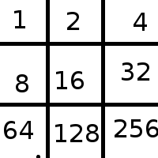

# Sommaire

* [API](#api)
  * [Authentification](#authentication)
  * [Routes](#routes)
* [Requests](#requests) 
  * [Types de requêtes](#types-de-request)
  * [Format de la requête](#format-de-la-request)
    1. [Envoyer la requête](#envoyer-la-requête)
    2. [Recevoir la réponse](#recevoir-la-réponse)
* [Workflow](#workflow)
  * [Se connecter à sa socket](#se-connecter-à-sa-socket)
  * [Rejoindre un Lobby](#rejoindre-un-lobby)
  * [Créer une Game](#créer-une-game)
  * [Rejoindre une Game](#rejoindre-une-game)
  * [Quitter une game](#quitter-une-game)
  * [Quitter un Lobby](#quitter-un-lobby)

* [Codes de retour des Sockets](#codes-des-sockets)
  * [Succès](#succès)
  * [Erreurs globales](#erreur-globales)
  * [Erreurs liées au Lobby](#erreurs-liées-au-lobby)
  * [Erreurs liées au User](#erreurs-liées-au-user)
  * [Erreurs liées a une Game](#erreurs-liées-a-la-game)
* [Websockets](#websockets)

# API

Accepts :
- application/x-www-form-urlencoded
- application/json

Remote test server : `https://morbak.alan-balbo.com`

## Authentication

* Login with `/api/auth/login`
* This should respond with something like :
```javascript
{
    "user": {
        "_id": "5ad0b5f26568137c6c85e228",
        "username": "MonBlaze",
        "creationDate": "2018-04-13T14:07:13.052Z",
        "__v": 0
    },
    "token": "MY_TOKEN"
}
```
* You should save the user somewhere, as well as the token
* **Again, the token should be saved in local storage for auto login**
* The token must be provided in the `Authorization` header of every request to the API, preceded with the `Bearer` keyword;  like so:
```
Authorization: Bearer MY_TOKEN
```

## Routes


| Name | Method | Route | Params |
|--|--|--|--|
|Login | POST|/api/auth/login | `{username: string, password: string} `  |
|Register | POST| /api/auth/register |  `{username: string, password: string} `|
|List Users | GET|/api/users |-
|Get User | GET|/api/users/:id |-
|Update user | PUT|/api/users/:id |  `{username?: string} `
|Create lobby | POST|/api/lobbies |  `{name: string} `
|List lobbies | GET|/api/lobbies |  `{limit?: number, offset?: number}`
|Get lobby | GET|/api/lobbies/:id | 
|Get lobby members | GET|/api/lobbies/:id/members | 
|Get lobby games | GET|/api/lobbies/:id/games | 
|Delete lobby | DELETE|/api/lobbies/:id | 
|List Games | GET|/api/games |  `{limit?: number, offset?: number}`
|Get Game | GET|/api/games/:id | 
|Create Request |POST|/api/request/ |  `{type: string, accessResource: ObjectId}`
|Get Request | GET|/api/request/:rid |  


# Requests

## Types de request 

`joinLobby` : Le user veut rejoindre un lobby

`joinGame` : Le user veut rejoindre une game

`invitePlayer` : Le user veut inviter un autre user à jouer

`createGame`: Le user veut créer une partie ouverte

`leaveGame`: Le user quitte la partie

`leaveLobby`: Le user quitte le lobby

## Format de la request 

### Envoyer la requête
Fair un appel sur `POST /request` avec le body suivant : 
```javascript
{
  type: 'joinLobby' | 'joinGame' | 'invitePlayer' | 'createGame',
  accessResource: "ResourceId"
}
```
La réponse à la requête est directement envoyée via HTTP

### Recevoir la réponse

Dans la **réponse à la requête** tu vas recevoir un objet.
- Soit elle a un `status: 'rejected'` et du coup tu peux afficher un message d'erreur comme quoi la requête associé à fail
- Soit elle a un `status: 'ok'` et tu peux interpréter le message 

Une reponse ressemble à ça :
```javascript
{
  request: Request // La request associée,
  message: '', // Un message explicite sur la response
  statusCode: 0, // Le code de retour normalisé de la response
  status: 'rejected' | 'ok' | 'aborted', // Le statut clair de la response
  resourceLink: '', // Un lien vers la resource associée
  time: 23165465132132, // timestamp 
  type: 'user' | 'lobby' | 'game'
}
```

(je documenterai les codes de retour sur le fil)

En gros, si ta request de type 'joinLobby' revient avec le statut 'ok', ça veut dire que tu as rejoins un lobby.
Donc si tu fais 

- GET /lobbies/{LobbyId}/members
Tu vas voir que tu es dans la liste des users du lobby, et quand tu feras le get, ça va te renvoyer un lien vers la websocket du lobby


# Workflow

## Se connecter à sa socket

// En cours de chantier. socket.io sera utilisé

## Rejoindre un Lobby

**Avant de pouvoir jouer, il faut rejoindre un lobby**


1. Envoyer une requête pour rejoindre le lobby:

`POST /api/requests`

|body|value|description
|-|-|-|
|type|`'joinLobby'`| L'action a performer
|accessResource|`5adcb42580876a5beecb943f`| L'id du lobby à rejoindre

2. Attendre la réponse :

```javascript
{
  requestId: '5adcb45580876a5beecb9440',
  message: 'Lobby joined',
  statusCode: 101,
  status: 'ok',
  resourceURI: '/api/lobbies/5adcb42580876a5beecb943f',
  time: 123454654161,
  type: 'user'
}
```

## Créer une Game

**Avant de pouvoir jouer, il faut créer une game**


1. Envoyer une requête pour créer la game:

`POST /api/requests`

|body|value|description
|-|-|-|
|type|`'createGame'`| L'action a performer
|accessResource|`5adcb42580876a5beecb943f`| Le lobby dans lequel créer la game

2. Attendre la réponse

```javascript
{
  requestId: '5adcb45580876a5beecb9440',
  message: 'Game created',
  statusCode: 301,
  status: 'ok',
  resourceURI: '/api/games/5adcb42580876a5beecb943f',
  time: 123454654161,
  type: 'user'
}
```

## Rejoindre une Game

**Avant de pouvoir jouer, il faut rejoindre une game**


1. Envoyer une requête pour créer la game:

`POST /api/requests`

|body|value|description
|-|-|-|
|type|`'joinGame'`| L'action a performer
|accessResource|`5adcb42580876a5beecb943f`| L'id de la game à rejoindre

2. Attendre la réponse

```javascript
{
  requestId: '5adcb45580876a5beecb9440',
  message: 'Game joined',
  statusCode: 302,
  status: 'ok',
  resourceURI: '/api/games/5adcb42580876a5beecb943f',
  time: 123454654161,
  type: 'user'
}
```

## Quitter une game


1. Envoyer une requête pour quitter la game:

`POST /api/requests`

|body|value|description
|-|-|-|
|type|`'leaveGame'`| L'action a performer
|accessResource|`5adcb42580876a5beecb943f`| L'id du user

2. Attendre la réponse

```javascript
{
  requestId: '5adcb45580876a5beecb9440',
  message: 'Game left',
  statusCode: 103,
  status: 'ok',
  resourceURI: null,
  time: 123454654161,
  type: 'game'
}
```

## Quitter un lobby

1. Envoyer une requête pour quitter le lobby:

`POST /api/requests`

|body|value|description
|-|-|-|
|type|`'leaveGame'`| L'action a performer
|accessResource|`5adcb42580876a5beecb943f`| L'id du user

2. Attendre la réponse

```javascript
{
  requestId: '5adcb45580876a5beecb9440',
  message: 'Lobby left',
  statusCode: 102,
  status: 'ok',
  resourceURI: null,
  time: 123454654161,
  type: 'lobby'
}
```

# Codes des sockets

## Succès
|statusCode|status|message|resource associée|détails
|-|-|-|-|-|
|`101`| `ok`| Lobby joined|URI du lobby joint
|`102`| `ok`| Lobby left| -
|`102`| `ok`| Game left|-
|`301`| `ok`| Game created|URI de la partie créée
|`302`| `ok`| Game joined|URI de la partie rejoint

## Erreur globales 

|statusCode|status|message|resource associée|détails
|-|-|-|-|-|
|`1001`| `rejected`| Internal Server Error|-|Une erreur côté serveur est survenue

## Erreurs liées au lobby
|statusCode|status|message|resource associée|détails
|-|-|-|-|-|
|`1101`| `rejected`| Lobby not found| -|Le lobby n'existe pas ou plus

## Erreurs liées au user
|statusCode|status|message|resource associée|détails
|-|-|-|-|-|
|`1201`| `rejected`| User not found| -|L'utilisateur n'existe pas ou plus
|`1202`| `rejected`| User already in a lobby|URI du lobby déjà joint|L'utilisateur est déjà dans un lobby
|`1203`| `rejected`| User already in a game|URI de la game du user|L'utilisateur est déjà dans une partie
|`1204`| `rejected`| User is not in the requested lobby| -|L'utilisateur n'est pas dans le même lobby que la partie
|`1205`| `rejected`| User already in this game|URI de la game du user|L'utilisateur est déjà dans la même partie

### Erreurs liées a la game
|statusCode|status|message|resouce associée|détails
|-|-|-|-|-|
|`1301`| `rejected`| Game not found| -|La partie n'existe pas ou plus
|`1302`| `rejected`| Game has already started| -|La partie a déjà commencé
|`1303`| `rejected`| Game is already full| -|La partie est pleine


# Websockets

Les websockets sont utilisées pour jouer à une partie.
Il faut utiliser socket.io

## Subscribe à une game

N'importe qui peut subscribe à la socket d'une game pour voir ce qu'il s'y passe. Sont référencés :
- Les tours de jeu
- Les connexions/déconnexions des joueurs à cette room
- Le status de la partie (winner/draw)

Pour rejoindre une game :
```javascript
const io = require('socket.io')(API_URI);
io.connect();
io.emit('joinGame', {
  gameID: 'GAME_ID'
});

io.on('message', (message) => {
 // Handle socket messages
 // {message: 'MESSAGE', data: Game, finished: Boolean}
});

io.on('error', (error) => {
  // Handle error message
  // {message: 'MESSAGE', stack: Object}
});

io.on('turn', (turn) => {
  // Handle turn event 
  // {message: 'MESSAGE', data: Game}
});
```

## Jouer son tour

Chaque joueur de la partie possède un secret qu'il peut récupérer sur la route `GET /api/games/{gameid}`. Le secret est un code à 5 caractères qui lui permet de jouer son tour.

Il doit préciser son secret ainsi que le move qu'il veut effectuer.
La grille ressemble à ça (dans chaque case, l'id du move correspondant):



Pour jouer son tour :

```javascript
const io = require('socket.io')(API_URI);
io.connect();
io.emit('playTurn', {
  gameID: 'GAME_ID',
  secret: 'PLAYER_SECRET',
  move: MOVE_ID
});

io.on('message', (message) => {
 // Handle socket messages
 // {message: 'MESSAGE', data: Game, finished: Boolean}
});

io.on('error', (error) => {
  // Handle error message
  // {message: 'MESSAGE', stack: Object}
});

io.on('turn', (turn) => {
  // Handle turn event 
  // {message: 'MESSAGE', data: Game}
});
```

## Fin de partie

Lorsque la partie est terminée, un message indiquand le vainqueur est envoyée sur la socket. Le boolean 'finished' sera à `true`

Il faudra ensuite que les joueurs quittent la partie.


